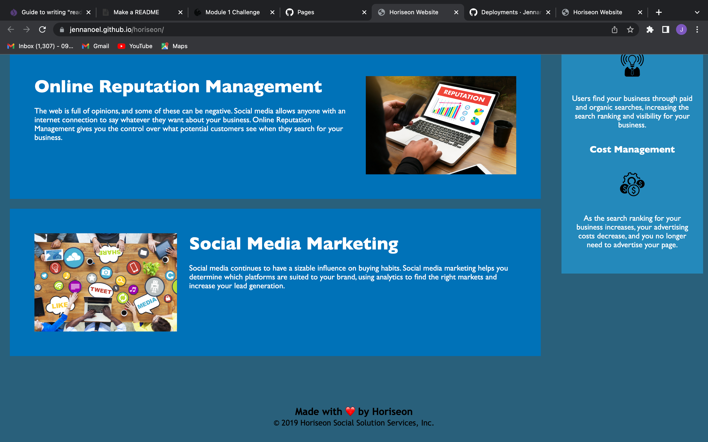

# Horiseon
A webpage with updated accessibility through the refactor of HTML and CSS codes.

## HTML
Upon viewing the source code you can recognize the updated semantic HTML code, allowing a more clean appearance to the code.

## CSS
The updated CSS code is properly aligned to the updated semantic HTML code, allowing all stylizations to appear on the deployed site.

## Visuals
Upon deployment the page should appear like this:

  
  
  ## Deployment
  
  The following link will take you to the deployed Horiseon website:
  https://jennanoel.github.io/horiseon/
  
